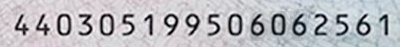
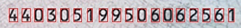

# 身份证号码识别

## 代码流程
1. 从原始图片中扣出身份证号码所处的一块图片 (opencv、边缘检测)
2. 将扣出的身份证号码整块图片切割成每个数字 (opencv、垂直投影)
3. 识别每个数字 （pytorch）

流程如下图所示

## 安装包
    pip install pytorch torchvision opencv-python numpy

## 要点提示
1. 对于身份证号码的印刷体数字识别，训练数据的获取方式是：通过字体渲染直接生成数据,详见gen_fake_sample.py。
   

## Reference
1. https://github.com/PowerOfDream/digitx.git
2. https://developer.aliyun.com/article/547689