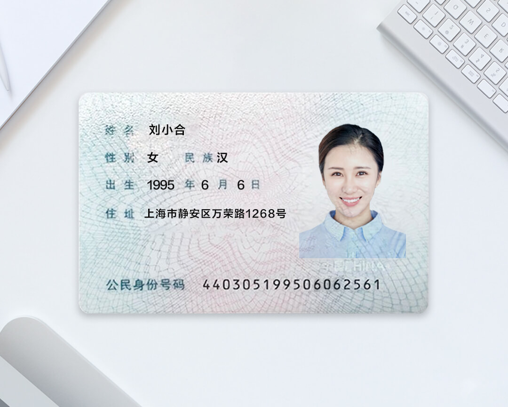
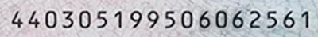
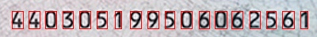

# 身份证号码识别

## 代码流程
1. 从原始图片中扣出身份证号码所处的一块图片 (opencv、轮廓检测)
2. 将扣出的身份证号码整块图片切割成每个数字 (opencv、垂直投影)
3. 识别每个数字 （pytorch）

流程如下图所示

## 安装包
    pytorch torchvision opencv-python numpy matplotlib

## 运行
    python run.py -p path_to_img_to_be_recognized
    showcase: python run.py -p ./test_imgs/sample.jpg

## 要点提示
1. 使用深度学习对身份证号码的印刷体进行识别，训练数据的获取方式是：通过字体渲染自己生成数据,而不是收集数据，详见`gen_fake_sample.py`。
2. 若要了解代码流程中 1， 2 步的具体流程，在`pre_process.py`, `get_column_num.py` 中将参数`DEBUG`改为`True`即可，届时便可查看代码执行过程中所产生的图片。
3. `get_photo.py` 为树莓派拍照的代码，大家可以不用管。

## TODO
1. 添加其他信息，如姓名、地址等信息的识别

## Reference
1. https://github.com/PowerOfDream/digitx.git
2. https://developer.aliyun.com/article/547689